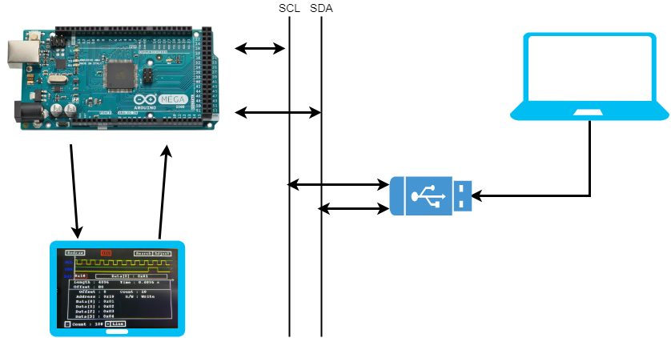

# 硬件课设

逻辑分析仪

分析I2C总线时序，并在屏幕中显示原始信号、解析结果

## 软件

- [x] 对I2C信号进行采样（1K采样4096数据点）
- [x] 可以在屏幕中显示原始信号
  - [x] 触摸屏操作左右滑动
  - [x] 缩放屏幕 
- [x] 对I2C信号进行解析，并显示基本信息
  - [x] 显示开始地址
  - [x] 显示地址
  - [x] 显示RW
  - [x] 显示数据长度
  - [x] 显示数据以及ACK/NACK，可以使用触摸屏操作上下滑动
- [x] 搜索I2C信号
- [x] 其它功能
  - [x] 屏幕刷新
  - [x] 调整触摸屏

## 硬件

- [x] 原理图
- [x] PCB
- [x] 立创商城
- [ ] 焊电路
- [ ] 测试

考虑到XPT2046芯片太小，还下了一单SMT

- [ ] 焊电路
- [ ] 测试

## 时间表

- [x] 10/5  提交周志
- [ ] 10/6  PCB
- [ ] 10/7  SMT
- [ ] 10/10 PPT
- [ ] 10/12 答辩（PPT与实物演示）
- [ ] 10/17 报告