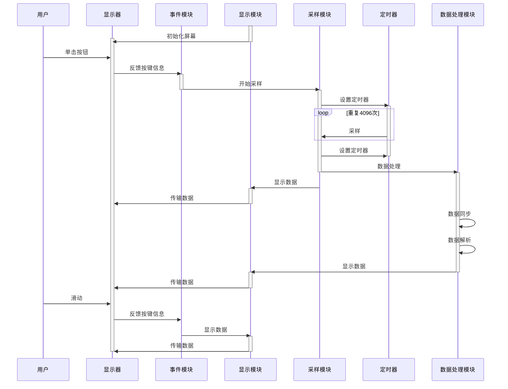

```mermaid
sequenceDiagram
    participant u as 用户
    participant l as 显示器
    participant e as 事件模块
    participant s as 显示模块
    participant c as 采样模块
    participant t as 定时器
    participant d as 数据处理模块

    activate s
    s->>l:初始化屏幕
    activate l
    deactivate s
    u->>l:单击按钮
    l->>e:反馈按键信息
    activate e
    e->>c:开始采样
    deactivate e
    activate c
    c->>t:设置定时器
    activate t
    loop 重复4096次
        t->>c:采样
    end
    c->>t:设置定时器
    deactivate t
    c->>d:数据处理
    deactivate c
    activate d
    c->>s:显示数据
    activate s
    s->>l:传输数据
    deactivate s
    d->>d:数据同步
    d->>d:数据解析
    d->>s:显示数据
    activate s
    deactivate d
    s->>l:传输数据
    deactivate s
    u->>l:滑动
    l->>e:反馈按键信息
    e->>s:显示数据
    activate s
    s->>l:传输数据
    deactivate s
    deactivate l

```